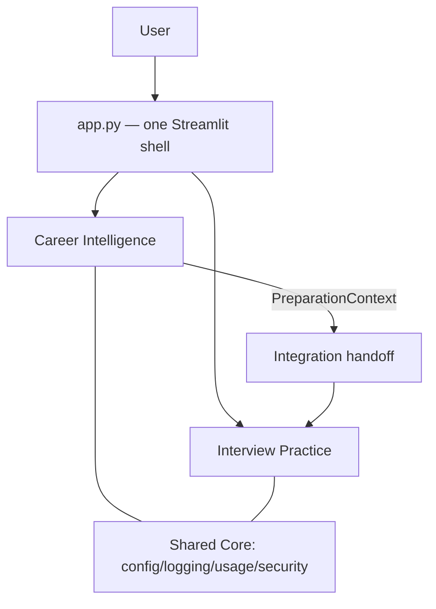
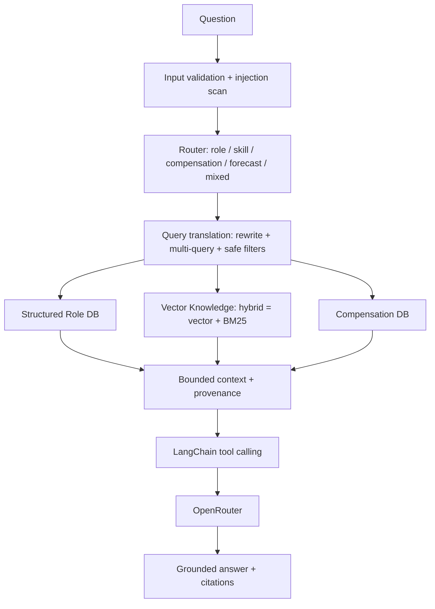
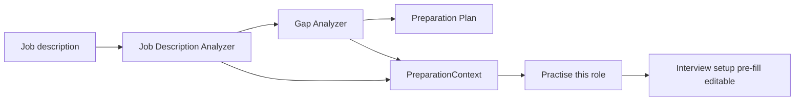
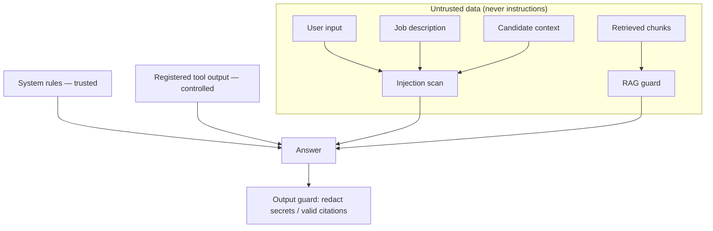

# Interview OS Coach

**Understand the opportunity. Prepare intelligently. Practise realistically.**

Interview OS Coach is one Streamlit application (`streamlit run app.py`, one URL)
that combines two product modules:

- **Career Intelligence** — evidence-grounded career guidance and interview
  preparation using RAG over a labour-market/careers knowledge base: LangChain +
  OpenRouter, embeddings, Chroma vector search, BM25 + hybrid retrieval, advanced
  query translation, four domain tool calls, citations, and prompt-injection
  security. Code: `src/career/ui.py` (UI) over the engine in `src/copilot/*`.
- **Interview Practice** — realistic interview simulation, rubric evaluation,
  Interview Deep Dive, final report, and voice/live practice with delivery
  coaching. Code: `src/interview/studio_app.py` over `src/*.py`.

Platform workflow: **UNDERSTAND → PREPARE → PRACTISE → REVIEW → IMPROVE**
(Career Intelligence covers Understand & Prepare; Interview Practice covers
Practise, Review & Improve). The two modules keep clear boundaries and are each
independently testable; see [docs/interview_os_architecture.md](docs/interview_os_architecture.md).

**Career Intelligence is a multi-source knowledge system**, not just a vector
store: a router sends each question to the right lane — a **Structured Role DB**
(ESCO/O*NET/ISCO/KldB in SQLite), **Vector Knowledge** (narrative docs in Chroma),
or a **Compensation DB** (OEWS/ASHE/Eurostat/Entgeltatlas) — every record
carrying provenance and source authority. See
[docs/knowledge_architecture.md](docs/knowledge_architecture.md). No datasets are
committed; reproduce with the `scripts/*` loaders (`source_status`,
`download_sources`, `normalise_roles`, `load_compensation`, `rebuild_vector_index`).

**RAG evaluation is versioned.** Phase 11R established the baseline benchmark
(`evaluations/retrieval_results.csv`, `rag_evaluation.md`), preserved unchanged
and copied to `evaluations/baseline/`. Phase 11R-A **measured** the expanded
multi-lane architecture (router / structured-role / compensation / provenance) —
see `evaluations/expanded_architecture_evaluation.md`. Core vector/keyword/hybrid
metrics are unchanged vs the baseline (the architecture adds lanes, it does not
alter narrative retrieval); the gain is coverage of structured role and
compensation questions. Reproduce with `python scripts/eval_expanded.py` (it
never overwrites the 11R baseline).

### Current Sprint: Career Intelligence

The **Career Intelligence** module is the active Turing College sprint ("Building
Applications with AI"). It implements the sprint's **Advanced RAG** (knowledge
base, chunking, embeddings, vector retrieval, query translation, structured
retrieval, hybrid search), **Tool Calling** (four domain tools via LangChain),
**LangChain** orchestration over **OpenRouter**, domain specialisation, and
**prompt-injection security**. A full requirement→location map (with tests) is in
[docs/sprint_requirements_after_integration.md](docs/sprint_requirements_after_integration.md),
and the RAG/LangChain design in [docs/rag.md](docs/rag.md),
[docs/query_translation.md](docs/query_translation.md),
[docs/hybrid_search.md](docs/hybrid_search.md),
[docs/tool_calling.md](docs/tool_calling.md) and
[docs/security.md](docs/security.md).

## Why it exists

Interview preparation is usually fragmented: you research a role in one place,
guess your gaps, and practise blind. Interview OS Coach joins the two halves —
**understand the role with evidence, then practise for it** — in one flow:

```
Understand role → identify gaps → prepare → practise → review → improve
```

## Current Turing sprint scope

The current **Building Applications with AI** sprint is represented primarily by
the **Career Intelligence** module. It demonstrates: LangChain, advanced RAG,
embeddings, vector retrieval, query translation, structured retrieval, hybrid
retrieval, tool calling, domain security, Streamlit and OpenRouter. The older
**Interview Practice** module existed **before** this sprint and is not part of
the sprint deliverable — it provides the real-world use case the sprint work
plugs into.

## Architecture

Modular monolith, one Streamlit process:

- **Shared Core** (`src/core/`) — infrastructure only: secrets, one composed
  `AppConfig`, safe logging, usage records, generic security primitives.
- **Career Intelligence** (`src/copilot/*`, UI `src/career/ui.py`) — the sprint
  module: knowledge, retrieval, RAG, tools, security, evaluation.
- **Interview Practice** (`src/*.py`, UI `src/interview/studio_app.py`) — the
  pre-existing interview simulator.
- **Integration** (`src/integration/`) — the only cross-module surface: the
  `PreparationContext` contract + the "Practise this role" handoff. Career and
  Interview never import each other.

### Architecture diagrams

**Platform**



**Career Intelligence retrieval**



**Career → Interview handoff**



**Trust / security boundaries**



## Knowledge architecture

Career Intelligence is a **multi-source** system, not one vector store:

```
Structured Role DB      Vector Knowledge      Compensation DB
(ESCO/O*NET/ISCO/KldB)  (reports/frameworks)  (OEWS/ASHE/Eurostat/Entgeltatlas)
            └───────────────┬───────────────┘
                      Hybrid Router
                            ↓
                 Grounded answer (with provenance)
```

**Why not everything in Chroma:** occupations/skills are relational and
enumerable (a taxonomy lookup, not nearest-prose); compensation is tabular and
context-bound (currency/period/geography/year); only narrative belongs in
vectors. Details: [docs/knowledge_architecture.md](docs/knowledge_architecture.md).

## Knowledge sources

Configured in [data/source_manifest.json](data/source_manifest.json). **No
datasets are committed** (see [docs/source_licensing.md](docs/source_licensing.md)).

| Source | Publisher | Role | Store | Geo | Year/Ver | Licence note |
| --- | --- | --- | --- | --- | --- | --- |
| O*NET | US DOL | occupations/skills | structured | US | 2024 | CC BY 4.0 |
| ESCO | European Commission | occupations/skills | structured | EU | v1.2.0 | review before reuse |
| ISCO-08 | ILO | occupation hierarchy | structured | global | 2008 | review before reuse |
| KldB 2010 | Bundesagentur für Arbeit | occupations | structured | DE | 2010 | review before reuse |
| OEWS | US BLS | compensation | structured | US | 2023 | public domain (US gov) |
| ASHE | UK ONS | compensation | structured | UK | 2023 | OGL v3.0 |
| Eurostat earnings | Eurostat | compensation | structured | EU | 2022 | CC BY 4.0 |
| Entgeltatlas | Bundesagentur für Arbeit | compensation | structured | DE | 2024 | review; manual |
| Cedefop Skills Forecast | Cedefop | labour-market forecast | vector | EU | 2023 | review; manual |
| EQF | European Commission | competency framework | vector | EU | 2017 | review; manual |
| Future of Jobs | World Economic Forum | industry report | vector | global | 2023 | review; manual |

## RAG flow

```
User → intent/routing → query translation → structured/vector/compensation
retrieval → tool calling → grounded answer → citations
```

## Tool calling

Four domain tools via LangChain (registered set only — no arbitrary code):

- **Job Description Analyzer** (LLM) — structured role requirements.
- **Candidate Gap Analyzer** (deterministic) — matched/partial/missing + match %
  computed in Python.
- **Preparation Plan Calculator** (deterministic) — time-boxed plan, Python
  arithmetic.
- **Interview Question Generator** (LLM) — categorised questions.

Details: [docs/tool_calling.md](docs/tool_calling.md).

## RAG evaluation

Actual results (committed synthetic corpus; local embedder). See
[evaluations/rag_evaluation.md](evaluations/rag_evaluation.md) and
[evaluations/expanded_architecture_evaluation.md](evaluations/expanded_architecture_evaluation.md).

**11R baseline** (33 cases, top_k=5):

| mode | Hit@5 | MRR | Recall@5 |
| --- | --- | --- | --- |
| vector | 0.97 | 0.842 | 0.955 |
| keyword | 0.97 | 0.904 | 0.97 |
| hybrid | 0.939 | 0.871 | 0.924 |

Honest finding: on this corpus with a lexical embedder, **keyword edges out
hybrid** — reported, not rewritten. Tool selection 1.0; citation validity 1.0.

**11R-A expanded architecture:** routing accuracy **1.0**, structured-role hit
**1.0** / provenance **1.0**, compensation accuracy **1.0** / provenance **1.0**.
Core vector/keyword/hybrid metrics are **unchanged vs baseline (Δ = 0)** — the
expansion adds lanes and coverage, it does not change narrative retrieval. No
improvement is claimed where the numbers do not show one.

## Security

- Prompt-injection scanning on all untrusted input (query, job description,
  candidate background); blocked attacks are refused.
- **Retrieved text is data, never instructions** — injected chunks are excluded.
- Tools are a fixed registry — no `eval`/shell/filesystem/network.
- Secrets via `SecretStr`, read from Streamlit secrets → env, never logged.
- Logging policy redacts candidate/JD/chunk/transcript/content; safe metadata
  only. Output guard redacts secret-like strings. See
  [docs/security.md](docs/security.md).

## Installation

```bash
python -m venv .venv && source .venv/bin/activate
pip install -e .           # runtime (includes RAG: Chroma + BM25)
pip install -e ".[dev]"    # + test tooling
```

Optionally add an OpenRouter key to `.streamlit/secrets.toml` or the environment
(`OPENROUTER_API_KEY`). The app boots without a key (with clear notices).

## Running

```bash
streamlit run app.py
```

One process, one URL. Everything (both modules) lives here.

## Optional services

- **Record** (voice answers) needs `pip install -e ".[speech]"` + a Google Speech
  project; without it, Record degrades to text.
- **Live** (Gemini) needs `pip install -e ".[live]"` + a Gemini key + the built
  frontend; without it, Live degrades to voice/text.

## Testing

```bash
pytest                                   # full Python suite
python -m compileall -q app.py src       # compile check
python scripts/eval_rag.py               # 11R RAG benchmark
python scripts/eval_expanded.py          # 11R-A expanded evaluation
(cd components/live_interviewer/frontend && npm test)   # frontend (vitest)
```

Latest: **959 passed, 1 skipped** (Python); **10 passed** (frontend).

## Known limitations

- Real datasets are not committed; the shipped corpus/samples are synthetic, so
  absolute evaluation numbers reflect that.
- The offline/local embedder is lexical; semantic vector quality needs an OpenAI
  embedding key.
- Deterministic injection defence is best-effort, not a guarantee.
- Structured role/compensation lanes are populated by the loader scripts; the
  baseline chat still runs vector RAG (lanes are surfaced + evaluated).
- Live LLM/Speech/Gemini paths require credentials and are not exercised in CI.

## Future roadmap (post-sprint)

- Wire the structured/compensation lanes directly into the chat answer path.
- Real dataset ingestion + semantic embeddings; labelled relevance judgements.
- Deeper interview↔career loop (feed interview outcomes back into preparation).

## Documentation

Reviewer-facing: [docs/reviewer_guide.md](docs/reviewer_guide.md),
[docs/assignment_traceability.md](docs/assignment_traceability.md),
[docs/demo_script.md](docs/demo_script.md),
[docs/team_leader_direction.md](docs/team_leader_direction.md),
[docs/rebuild_knowledge_base.md](docs/rebuild_knowledge_base.md),
[docs/source_licensing.md](docs/source_licensing.md).

---

## Interview Practice (module)

**Prepare for any role. Practise realistically. Improve every answer.**

> **Status note (feature completion during the capstone).** **Text Practice is
> complete and fully working.** The **Voice** (Google Speech-to-Text) and
> **Live** (Gemini Live) modes are **wired end to end in code but ship as
> placeholders**: I will finish and verify them live during the capstone once the
> required cloud credentials are in place. Until then, the app runs on Text and
> shows a graceful fallback for Voice/Live (no crashes, no lost progress). See
> [docs/product_readiness_report.md](docs/product_readiness_report.md).

## Project overview

Interview Practice Studio is an LLM-powered interview practice application for
candidates in **any profession** — technology, healthcare, finance, skilled
trades, education, public service and beyond — at any career level and for any
interview type. It is a Turing College Sprint 1 project built with Python,
Streamlit and the OpenRouter Chat Completions API.

The app conducts a realistic, multi-turn mock interview: it analyses the target
role, asks one question at a time, evaluates each answer against a transparent
rubric, offers a personalisable improved-answer example and a follow-up
question, and finishes with a readiness report you can download.

## Problem being solved

Interview practice is usually generic, hard to get feedback on, and biased
toward a single discipline. Candidates rarely get structured, role-relevant
feedback on *how* they answered. This app gives realistic, profession-neutral
practice with concrete, evidence-based feedback — framed as practice guidance,
never as a hiring decision.

## Target users

Job candidates preparing for interviews in any field and at any level, plus
learners exploring prompt engineering and LLM application patterns. It is a
learning/practice tool, not a recruitment or assessment system.

## Supported role types

The taxonomy is deliberately generic. Career levels: internship/apprenticeship,
entry, professional, senior professional, manager, director, executive.
Interview types: recruiter screening, behavioural, technical/functional,
case/problem-solving, leadership, culture and values, stakeholder/client, panel,
and executive/board. Interviewer personas: friendly recruiter, neutral hiring
manager, challenging functional expert, sceptical executive, fast-paced panel.

## Core features

- Interview setup form (role, sector, career level, company context, job
  description, background, interview types, persona, difficulty, question count,
  response detail).
- Role analysis (an interview **strategy**).
- Multi-turn mock interview using a real chat interface.
- **Interview Deep Dive** — branch from an evaluated answer to explore a topic
  more deeply (bounded to two levels) before returning to the main interview.
- Rubric-based answer evaluation (overall score + seven criteria).
- Improved-answer example (labelled to personalise) and a follow-up question.
- Final readiness report with **JSON** and **Markdown** downloads.
- Token and cost reporting (USD).
- **Prompt Lab** for developer experimentation (kept separate from the
  candidate flow).
- Five prompt-engineering techniques and three approved models.
- A deterministic security guard and an exported jailbreak evaluation.

## Feature status

| Feature | Status | Notes |
|---|---|---|
| **Text Practice** | ✅ Complete | Full flow: setup → strategy → questions → answers → feedback → Deep Dive → report. Fully tested. |
| Interview Deep Dive | ✅ Complete | Bounded two-level follow-ups. |
| Accounts, history, dashboard | ✅ Complete | OIDC-optional; user-scoped persistence; export/delete. |
| Delivery & pacing coach | ✅ Complete | Works for recorded voice / live once those are enabled. |
| **Voice Practice (Speech-to-Text)** | 🚧 Under development | Google Cloud Speech-to-Text V2 (Chirp 3). Wired end to end and unit-tested, but **not yet verified live** — needs a Google Cloud project, billing, the Speech API enabled and Application Default Credentials. Until then, selecting **Voice** shows a clear unavailable state and **Text still works**. |
| **Live Interview (Gemini Live)** | 🚧 Under development | Real-time voice interviewer via Gemini Live + a built browser component. Wired end to end (backend ephemeral-token service, frontend built, tests pass), but **not yet verified live** — needs a `GEMINI_API_KEY` and a confirmed Live model id. Until then, selecting **Live** shows *"Live interview is temporarily unavailable"* with **Continue with recorded voice / text**, and no answers are lost. |
| **Visual Engagement Coach** | 🚧 Experimental (opt-in) | Camera-based, local-only coaching for the live interview. Off by default; coaching-only (never a score); processed entirely in the browser. |

> **Why "under development"?** Voice and Live are complete in code and covered by
> automated tests (with all provider calls mocked), but they depend on paid cloud
> credentials that are **provisioned and verified live during the capstone**. The
> product is designed so these are **optional add-ons**: without their keys the app
> runs fully on **Text Practice** and degrades gracefully — never crashing and
> never losing completed answers. See
> [docs/product_readiness_report.md](docs/product_readiness_report.md) for the
> exact status, evidence and remaining steps.

## Application workflow

`SETUP` → generate strategy (`STRATEGY_READY`) → ask a question
(`AWAITING_ANSWER`) → submit answer (`EVALUATING`) → show feedback
(`INTERVIEW_IN_PROGRESS`) → next question or finish → `INTERVIEW_COMPLETE` →
final report (`REPORT_READY`). `ERROR` is a recoverable side-state. See
[docs/architecture.md](docs/architecture.md).

## Interview Deep Dive

Interview Deep Dive lets candidates pause the normal interview sequence and
explore a question more deeply through contextual follow-up questions before
returning to the main interview — like an interviewer probing an answer,
challenging assumptions, asking for evidence or exploring trade-offs. It is a
bounded, interview-focused feature (maximum two deeper levels), **not** an
autonomous agent or a general-purpose chatbot: branch questions are anchored to
the parent question and the candidate's actual answer, branch answers are framed
as untrusted data, and a branch never advances the main interview's progress.

## Voice answers (speech-to-text)

For every question — main interview and Deep Dive — the candidate can **type** or
**record** an answer (typing remains the default). A recording is played back,
transcribed, and shown as an **editable transcript** the candidate reviews before
submitting; nothing is auto-submitted, and the edited transcript flows into the
same evaluation pipeline. Transcription uses a provider-agnostic
`SpeechTranscriptionService` (`src/speech_service.py`); the first provider is
Google Cloud Speech-to-Text V2 (Chirp 3). Raw audio is never saved, transcripts
are verbatim, and speech is optional — without credentials the text interview
works unchanged and the voice control shows a clear unavailable state. Install
the speech extra with `pip install -e ".[speech]"` and configure a Google project
(see Configuration). Details in [docs/architecture.md](docs/architecture.md).

## Live interview (experimental)

An optional third mode alongside Text and Voice practice: a real-time voice
interviewer powered by Gemini Live. **OpenRouter remains the only interview
engine** — it still authors the questions, evaluates answers, runs Deep Dive and
writes the report; Gemini Live only *speaks* the canonical question and streams
the candidate's audio and live transcript, which flows into the same evaluation
pipeline. The permanent Gemini key never reaches the browser — the backend mints
short-lived **ephemeral tokens** ([src/live_interview.py](src/live_interview.py))
and the real-time audio/WebSocket work lives in a package-based Streamlit
component ([components/live_interviewer/](components/live_interviewer/)). It is
experimental and fully optional: without a Gemini key or a built component, Live
shows a fallback and Text/Voice work unchanged. Enable with
`pip install -e ".[live]"`, `GEMINI_API_KEY`, and building the component
(`cd components/live_interviewer/frontend && npm install && npm run build`). See
[docs/architecture.md](docs/architecture.md) and the manual QA plan in
[docs/live_interview_qa.md](docs/live_interview_qa.md).

## Visual Engagement Coach (optional, experimental)

An optional camera-based practice aid for the live interview. It is **coaching
only**: it never decides whether you are attentive, truthful or suitable, never
affects any score, and makes no psychological/medical judgements. Camera is
**off by default**; you opt in after a plain disclaimer, and the interview works
fully without it. All processing is **local in the browser** (MediaPipe Face
Landmarker) — no video, screenshots, frames or biometric data are ever sent to a
backend or stored; only small aggregated metrics (e.g. screen-facing percentage,
extended-away periods) are returned, and a clearly-named `gaze_direction_proxy`
is used — never an "attention score". You can disable it or clear its metrics at
any time. Details in [docs/architecture.md](docs/architecture.md); manual checks
in [docs/live_interview_qa.md](docs/live_interview_qa.md).

## Candidate experience

The app presents a **Practice Interview** with three friendly modes — **Text**,
**Voice** and **Live** — chosen from simple cards; technical concepts (models,
tokens, JSON, reasoning) stay out of the candidate's way in a collapsed developer
expander. During the interview a professional **interviewer avatar**
([src/avatar.py](src/avatar.py), a swappable `AvatarRenderer`) shows tasteful
speaking/listening/thinking states next to clear progress ("Question X of Y"),
a captions toggle, and always-labelled waiting states. Every failure keeps
completed results and offers a concrete next step (retry / switch to text or
voice / reset) rather than restarting. The avatar is neutral, accessible
(`aria-label`, reduced-motion aware) and local by default.

## Accounts, history & dashboard

The app can persist your practice across sessions. Sign-in uses Streamlit's
native OIDC (Google, Microsoft, …) behind a small auth abstraction
([src/auth.py](src/auth.py)); it is **optional for local development** (anonymous)
and **required in production** (`APP_AUTH_REQUIRED=true`). Data is stored via one
SQLAlchemy layer ([src/persistence.py](src/persistence.py)) — **SQLite** for dev,
**PostgreSQL** for production — accessed only through a user-scoped repository
([src/repository.py](src/repository.py)), so **one user can never see another's
history**. Candidate pages: **Dashboard**, **New Practice**, **Interview
History**, **Progress**, **Settings**. You can export your data and delete
individual interviews or everything. Only appropriate data is stored — never
camera video, face frames, biometric templates, permanent keys or raw audio.
Production migrations use Alembic (`pip install -e ".[db]"`, then
`alembic upgrade head`); dev creates tables automatically. See
[docs/architecture.md](docs/architecture.md).

## Architecture

A thin Streamlit UI (`app.py`) renders only; all behaviour lives in `src/`:
domain models, a prompt library and registry, a security layer, an OpenRouter
client, a pricing service, a response parser, four interview services and a
session-state machine. Full details and diagram in
[docs/architecture.md](docs/architecture.md).

## Technology stack

Python, Streamlit, OpenRouter Chat Completions API, HTTPX, Pydantic v2, Pytest,
openpyxl, python-dotenv. No LangChain, LangGraph, RAG, embeddings, vector
databases, agents, or databases — see [Known limitations](#known-limitations).

## OpenRouter integration

`src/openrouter_client.py` is a typed, non-streaming client for
`POST https://openrouter.ai/api/v1/chat/completions`. It uses Bearer
authentication (the key is a masked `SecretStr`, never logged), explicit connect
and read timeouts, correct `system` / `user` / `assistant` role separation, and
maps every failure (missing key, 400/401/402/429, 5xx, timeout, network, invalid
JSON, empty choices, missing usage, unsupported parameter) to a controlled
error. It logs nothing by default; a safe debug mode logs only request ID,
model, duration and a coarse status category.

## Prompt-engineering techniques

Five techniques, all producing the same `AnswerEvaluation` schema so they can be
compared fairly: **zero-shot instruction**, **role and persona prompting**,
**few-shot prompting**, **structured analytical procedure**, and
**rubric-constrained structured output**. Full explanations in
[docs/prompt_engineering.md](docs/prompt_engineering.md).

## Model settings

Adjustable per session: model, prompt technique, temperature and maximum output
tokens (bounds in `src/constants.py`). Structured output (`response_format`) and
temperature are sent only when the selected model's metadata reports support for
them.

## Approved models

| Model | Role |
| --- | --- |
| `openai/gpt-5-mini` | Default |
| `openai/gpt-5-nano` | Lower cost |
| `openai/gpt-5` | Higher capability |

## Structured JSON outputs

Validated Pydantic v2 models (`src/models.py`): `InterviewStrategy`,
`InterviewQuestion`, `AnswerEvaluation`, `FinalInterviewReport`, plus
`UsageRecord` and `ModelPricing`. Model output is parsed safely (fences
stripped, `json.loads` only — never `eval`/`exec`), validated, and given exactly
**one** repair attempt before a controlled error.

On the `product/full-fledged-interview-app` branch this is upgraded to
**provider-enforced strict JSON Schema** (generated from the same Pydantic
models via `model_json_schema()`) when the selected model advertises
`structured_outputs`; enforcement removes the need for JSON repair. Models
without enforcement keep the defensive parser and one repair. See
[docs/architecture.md](docs/architecture.md).

## Security and privacy controls

A deterministic, best-effort guard (`src/security.py`): input normalisation and
length limits; weighted prompt-injection scoring with `allow` /
`allow_with_warning` / `block`; a scope guard; untrusted-content wrapping;
output leakage and secret-like output detection; bounded Base64 decode-and-
rescan; and spreadsheet formula-injection protection. Full details in
[docs/security.md](docs/security.md). **This is not perfect jailbreak
protection.**

## Token and cost reporting

`src/pricing_service.py` reads live model pricing from OpenRouter and caches it
per session. Cost precedence is **reported → calculated → unavailable**, always
in USD; calculated figures are labelled estimates, not final bills. Cumulative
session cost is tracked without double-counting across Streamlit reruns.

## Prompt comparison

`scripts/compare_prompts.py` runs the five techniques on one fixed
profession-neutral scenario with the model, temperature and token limit held
constant. Dry run by default (no network); a live run needs `--run --confirm`.
Results write to `evaluations/prompt_comparison.{md,json}`. See
[docs/prompt_engineering.md](docs/prompt_engineering.md) for the current
recorded state.

## Model-setting comparison

`scripts/compare_model_settings.py` sweeps temperature (0.1/0.5/0.9) and
concise/detailed token limits with the model and technique held constant, only
sweeping parameters the model supports. Results write to
`evaluations/model_settings_comparison.{md,json}`.

## Jailbreak and invalid-input testing

`scripts/run_jailbreak_tests.py` runs a fixed battery of **29 deterministic
cases across 16 categories** through the guard and exports an Excel workbook
(Summary + Detailed sheets) and CSV. Current recorded result:
**29/29 passed, 21 blocked, 1 warning, 7 allowed, 21 model calls prevented,
5 false-positive candidates** (`evaluations/jailbreak_test_results.xlsx`). Dry
run by default; live-assisted mode needs `--run-live --confirm`.

## Installation

macOS / Linux:

```bash
git clone https://github.com/moaltamimi-unbiasedtalent/Interview-Practice-Studio.git
cd Interview-Practice-Studio
python3 -m venv .venv
source .venv/bin/activate
python -m pip install --upgrade pip
pip install -r requirements.txt
cp .streamlit/secrets.toml.example .streamlit/secrets.toml
```

Requires Python 3.10+ (developed and tested on 3.12).

`pyproject.toml` is the source of truth for dependencies: runtime pins live under
`[project.dependencies]` (mirrored by `requirements.txt` for convenience) and the
test/development tools under `[project.optional-dependencies]`. To install the
project with its dev tools (pytest):

```bash
pip install -e ".[dev]"
```

## Configuration

Add your OpenRouter key to `.streamlit/secrets.toml` (preferred) or a `.env`
file (local fallback). Both are gitignored; **never commit a key**. The app
never uses a default key and shows a controlled message when none is configured.

`.streamlit/secrets.toml`:

```toml
OPENROUTER_API_KEY = "your-key-here"
```

## Running the Streamlit application

```bash
streamlit run app.py
```

## Running automated tests

```bash
pytest -q
```

The suite (450 tests) makes **no live network calls**; all model and pricing
requests are mocked.

## Running prompt comparison

```bash
python scripts/compare_prompts.py                 # dry run (no network)
python scripts/compare_prompts.py --run --confirm # live, chargeable
```

## Running model-setting experiments

```bash
python scripts/compare_model_settings.py                 # dry run
python scripts/compare_model_settings.py --run --confirm # live, chargeable
```

## Running the jailbreak experiment

```bash
python scripts/run_jailbreak_tests.py                       # dry run (no network)
python scripts/run_jailbreak_tests.py --run-live --confirm  # optional live-assisted
```

## Repository structure

```
app.py                      Streamlit UI (single page, routed on session state)
src/
  config.py                 API-key resolution (secrets -> env), timeouts, URLs
  constants.py              Approved models, limits, taxonomies, thresholds
  models.py                 Validated Pydantic domain models
  prompts.py                Five techniques + task-aware message assembly
  prompt_registry.py        Technique catalogue for the UI/experiments
  security.py               Deterministic security & privacy guards
  openrouter_client.py      Typed OpenRouter Chat Completions client
  pricing_service.py        Usage accounting & pricing (USD)
  response_parser.py        Safe JSON parse + one repair round
  interview_service.py      Base service + strategy & next-question use cases
  evaluation_service.py     Answer-evaluation use case
  report_service.py         Final-report use case
  session_manager.py        Interview state machine over session_state
  ui_helpers.py             UI label<->id maps, formatting, report serialization
scripts/
  compare_prompts.py        Prompt-comparison experiment
  compare_model_settings.py Model-setting experiment
  run_jailbreak_tests.py    Jailbreak / invalid-input battery -> xlsx + csv
evaluations/                Generated experiment artefacts
tests/                      Pytest suite (no live API calls)
docs/                       Architecture, prompts, security, review docs
.streamlit/                 Streamlit config + secrets example
CLAUDE.md                   Development rules for AI-assisted work
```

## Known limitations

LLM feedback can be inaccurate; scores are advisory, not hiring decisions; the
security guard is best-effort (not perfect); estimated cost is not the final
bill; user content is processed by OpenRouter and the selected provider; there
is no persistence, authentication or user database; and Sprint 1 does **not**
include LangChain, LangGraph, RAG, embeddings, vector databases, agents or a
database. Full list: [docs/limitations.md](docs/limitations.md).

## Future improvements

Sprint 2 could add retrieval-augmented context (RAG) over a candidate's CV and
the job description, richer accessibility validation, persistence with explicit
consent, and live-model regression tests behind the gated experiment paths.

## Academic integrity and use of AI tools

AI tools — including Claude Code and ChatGPT — were used for planning,
implementation support, debugging, testing and documentation support. The
learner is responsible for reviewing, understanding and being able to explain
the submitted implementation; AI assistance does not replace personal
understanding, and external assistance is acknowledged honestly here. No private
conversation transcripts are included.

## Screenshots

No screenshots are committed yet. Capture the following (suggested path
`docs/screenshots/`) and add them here before submission:

| Filename | Should demonstrate |
| --- | --- |
| `01_setup_form.png` | The interview setup form with a role and job description |
| `02_role_analysis.png` | A generated interview strategy |
| `03_mock_interview.png` | The chat interview with a question and answer |
| `04_feedback.png` | Structured feedback (overall + seven scores) |
| `05_final_report.png` | The final report with JSON/Markdown download buttons |
| `06_usage_panel.png` | The sidebar usage & cost panel |
| `07_prompt_lab.png` | The Prompt Lab with the confirmation gate |
| `08_jailbreak_workbook.png` | The jailbreak results workbook (Summary sheet) |

Do not fabricate screenshots; only claim they exist once the files are added.

## Repository information

- **Repository:** `moaltamimi-unbiasedtalent/Interview-Practice-Studio`
- **Branch:** `main`

## A note on feedback

Interview scores and feedback are **practice guidance only** — not objective
hiring decisions, and not assessments of personality or psychology.

## Production readiness & operations

Final integration hardening (Phase 22) added: a full mocked E2E pipeline test, a
consolidated security suite, startup validation + health check (`src/health.py`),
a Dockerfile (no secrets baked in), a CI workflow, a confirmation-gated manual
live-API suite (`scripts/manual_live_check.py`), and an offline security-
classifier experiment. See:

- [docs/product_readiness_report.md](docs/product_readiness_report.md) — status, evidence, blockers
- [docs/operations_deployment.md](docs/operations_deployment.md) — config, Docker, CI, secrets, migrations
- [docs/testing.md](docs/testing.md) — test layers and how to run them
- [docs/privacy.md](docs/privacy.md) — data handling and retention
- [docs/security.md](docs/security.md) · [docs/architecture.md](docs/architecture.md) · [docs/limitations.md](docs/limitations.md)
