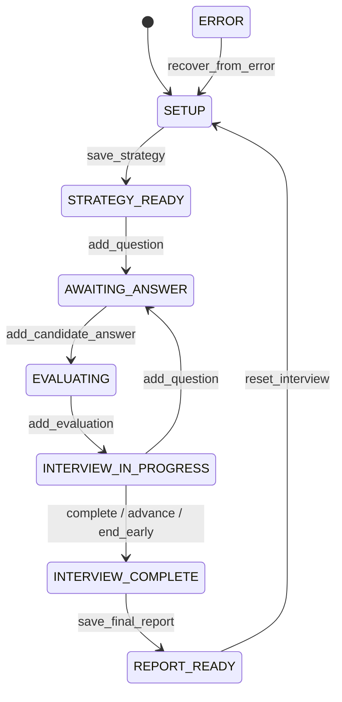

# Architecture — Interview Practice Studio

## Product objective

Help any candidate — in any profession, industry, career level or interview
type — prepare for interviews by practising realistically against an LLM
interviewer and receiving structured, actionable feedback on every answer.
The product is deliberately generic: nothing in prompts, scoring or examples
assumes a specific domain.

## User journey

1. The candidate opens the app and optionally pastes a job description and a
   short background summary.
2. They choose an interview type (e.g. behavioural, technical, situational),
   career level, model and settings.
3. The app conducts a conversational practice interview: it asks questions,
   the candidate answers, and the conversation continues naturally.
4. After each answer (or on request) the candidate receives structured
   feedback: rubric-based scores, strengths, improvements and a suggested
   revision.
5. Token usage and estimated cost are visible throughout.

## Proposed architecture

```
┌────────────────────────────────────────────────┐
│ app.py — Streamlit UI (single page, routed)    │
│  header · setup · chat · report · usage        │
└──────────────┬─────────────────────────────────┘
               │ calls
┌──────────────▼─────────────────────────────────┐
│ src/ — business logic                          │
│  config.py             configuration loading   │
│  constants.py          limits, models, values  │
│  models.py             validated domain models │
│  prompts.py            system prompt library   │
│  prompt_registry.py    technique catalogue     │
│  security.py           security/privacy guards │
│  openrouter_client.py  OpenRouter API client   │
│  pricing_service.py    usage & cost accounting │
│  response_parser.py    safe response parsing   │
│  interview_service.py  strategy + questions    │
│  evaluation_service.py answer evaluation       │
│  report_service.py     final report            │
│  session_manager.py    conversational state    │
│  ui_helpers.py         UI labels/serialization │
└──────────────┬─────────────────────────────────┘
               │ HTTPS (HTTPX)
┌──────────────▼─────────────────────────────────┐
│ OpenRouter Chat Completions API                │
│  openai/gpt-5-mini | gpt-5-nano | gpt-5        │
└────────────────────────────────────────────────┘
```

## Main components

- **`app.py`** — Streamlit rendering only; no business logic.
- **`src/config.py`** — resolves the API key (Streamlit secrets first,
  environment fallback); returns a controlled result when missing.
- **`src/constants.py`** — the single source of truth for approved models,
  generation defaults, input length limits and every enum-like value set.
- **`src/models.py`** — validated Pydantic domain models and
  structured-output schemas. Inputs (`InterviewConfiguration`,
  `ModelSettings`), model outputs (`InterviewStrategy`, `InterviewQuestion`,
  `AnswerEvaluation`, `FinalInterviewReport`, `BranchQuestion`) and accounting
  (`UsageRecord`) are validated here so the rest of the app can trust its data.
- **`src/prompts.py`** — the system-prompt library: five prompt-engineering
  techniques, shared safety guardrails, a schema-derived output contract, and
  role-separated message assembly (`build_messages`).
- **`src/prompt_registry.py`** — a UI-facing catalogue mapping each stable
  technique ID to a name, description and use case, with safe rejection of
  unknown IDs and Streamlit selector options.
- **`src/security.py`** — deterministic, best-effort security and privacy
  guards: input validation/normalisation, prompt-injection risk scoring, a
  scope guard, untrusted-content wrappers, an output guard and UI-ready
  privacy notices.
- **`src/openrouter_client.py`** — a typed, non-streaming OpenRouter
  chat-completions client: Bearer auth, explicit timeouts, full error mapping,
  a safe debug mode, and a connection-test helper.
- **`src/pricing_service.py`** — usage accounting and pricing: reads live model
  pricing/metadata (cached per session), resolves reported vs calculated vs
  unavailable cost in USD, and tracks cumulative session usage.
- **`src/response_parser.py`** — turns raw model text into a validated domain
  object: strips code fences, parses JSON safely (never `eval`/`exec`),
  validates through the correct Pydantic model, allows one repair round, and
  raises a controlled error otherwise.
- **`src/interview_service.py`** — the shared generation base plus the
  strategy and next-question use cases.
- **`src/evaluation_service.py`** — the answer-evaluation use case.
- **`src/report_service.py`** — the final-report use case.
- **`src/session_manager.py`** — the interview state machine and all
  per-session data, over a namespaced Streamlit `session_state` store.
- **`src/ui_helpers.py`** — pure UI helpers: the label↔domain-id catalogues,
  cost formatting and report (JSON/Markdown) serialization, kept out of
  `app.py` so they can be unit-tested without Streamlit.
- **`app.py`** — the full single-page Streamlit experience (header, setup form,
  developer sidebar, role analysis, chat interview, feedback, final report with
  downloads, usage panel and reset), routed on the session state.
- **Later phases** — the prompt-comparison and jailbreak experiments.

## Domain models and structured outputs

`src/models.py` defines seven Pydantic models on a shared `_StudioModel` base
whose policy is applied everywhere: surrounding whitespace is stripped from
strings, unknown fields are rejected (`extra="forbid"`), and assignment is
validated as well as construction. Reusable field types keep the rules
consistent and readable:

- **Enum-like fields** (career level, interview type, persona, difficulty,
  response detail, prompt technique, cost source, model) are validated
  against the tuples in `src/constants.py` — models never hard-code allowed
  values.
- **Required text** rejects empty / whitespace-only content and is length
  bounded; **required lists** must be non-empty and cannot contain blank
  items.
- **Scores** are range-checked: overall scores 0–100, rubric scores 1–10.
- **`UsageRecord`** additionally enforces cross-field rules —
  `total_tokens == prompt_tokens + completion_tokens`, USD-only currency, and
  a reported cost whenever `cost_source == "reported"`.

The models are deliberately profession-neutral, store no protected
demographic information, and contain no hidden chain-of-thought field:
feedback is concise and structured, never a private monologue.

## Prompt-engineering library

`src/prompts.py` provides five system-prompt techniques — zero-shot,
role/persona, few-shot, structured analytical procedure, and
rubric-constrained structured output. All five target the *same* task and the
*same* `AnswerEvaluation` schema; only a technique-specific *method* block
changes, which is what makes the later prompt-comparison experiment fair. Each
prompt is assembled from shared blocks (mission, guardrails, session
parameters, task, method, output contract), and the output contract is
generated from `AnswerEvaluation.model_fields` so prompts cannot drift out of
sync with the models.

The trust boundary is enforced in message assembly: the **system** message
carries only repository-authored text plus fixed-vocabulary session settings,
while every free-text field the candidate supplies is placed in the **user**
message inside `<<<UNTRUSTED_REFERENCE_DATA>>>` delimiters. The shared
guardrails instruct the model to treat that content as data only, never follow
instructions embedded in it, never reveal the system prompt or hidden
reasoning, never fabricate achievements, label improved answers as examples to
personalise, stay profession-neutral, and avoid protected characteristics.

`src/prompt_registry.py` sits above the builders as a UI-facing catalogue:
`list_techniques()` and `selector_options()` drive the Streamlit selector,
`get_technique()` returns a technique's metadata and builder, and unknown IDs
raise a controlled `UnknownPromptTechniqueError` rather than crashing or
silently defaulting. See `docs/prompt_engineering.md` for each technique's
definition, benefits, risks, best use and expected effect.

## Security and privacy guards

`src/security.py` is a deterministic, **best-effort** defence layer (not
perfect or production-grade — the primary boundary is architectural). It
provides six controls that wrap the data flow:

- **Input validation** — `sanitize_text` removes null bytes, unsafe control
  and zero-width characters and collapses excessive whitespace; `validate_field`
  enforces named length limits and required-ness, rejecting oversized input
  rather than truncating it, with safe user-facing errors.
- **Injection detection** — `detect_injection` normalises text (defeating
  spacing/punctuation/leetspeak obfuscation) and scores it against multiple
  weighted indicators, returning one of three outcomes: `allow`,
  `allow_with_warning`, `block`.
- **Scope guard** — `check_scope` allows the full range of interview activities
  and blocks only clearly malicious, off-scope requests.
- **Untrusted-content wrappers** — `wrap_job_description`,
  `wrap_candidate_background` and `wrap_candidate_answer` frame content as
  data-only, reinforcing the message-separation boundary.
- **Output guard** — `inspect_output` checks JSON/schema validity, response
  size, system-prompt leakage markers and secret-like patterns.
- **Privacy notices** — `PRIVACY_NOTICES` provides UI-ready guidance.

See `docs/security.md` for the threat model, each control and the guard's
stated limitations.

## OpenRouter integration, usage and pricing

`src/openrouter_client.py` is a typed, **non-streaming** client for
`POST https://openrouter.ai/api/v1/chat/completions`. It:

- reads `OPENROUTER_API_KEY` securely via `AppConfig` (a masked `SecretStr`)
  and authenticates with a Bearer token;
- accepts `model`, `messages`, `temperature` and `max_tokens`, and attaches
  `response_format` only when the selected model supports it (otherwise it
  raises `UnsupportedParameterError` before any network call);
- uses explicit connection and read timeouts;
- returns a typed `ChatResult` (assistant content, actual model, prompt/
  completion/total tokens, reported cost, request duration, request ID);
- maps every failure to a specific exception — missing key, 400/401/402/429,
  5xx/upstream, timeout, network error, invalid JSON, empty choices — and
  degrades gracefully when usage is missing;
- logs nothing by default; a **safe debug mode** logs only request ID, model,
  duration and a coarse status category — never headers, keys or content;
- exposes `test_connection()`, a deliberately tiny request the UI runs only
  when the user presses a "Test connection" button.

`src/pricing_service.py` handles usage accounting and cost:

- prices are **read from OpenRouter model metadata** (`/models`) and cached for
  the session — never hard-coded;
- cost precedence is **reported** (from usage data) → **calculated** (from
  metadata, using `Decimal` for precision) → **unavailable**, and every
  `UsageRecord` records which source was used;
- all figures are in USD, and calculated figures are labelled estimates, not
  final billed amounts;
- `supported_parameters` from metadata drives the client's structured-output
  decision;
- cumulative session usage (tokens and cost) is tracked via
  `SessionUsageTotals`.

## Application services and orchestration

The service layer turns the building blocks into four use cases, each returning
a validated domain object **and** a `UsageRecord`:

1. **Generate strategy** (`InterviewService.generate_strategy`) →
   `InterviewStrategy`.
2. **Generate the next question** (`InterviewService.generate_next_question`) →
   `InterviewQuestion`, adapting to profession, seniority, interview types and
   any job description, avoiding previously-asked questions, and never assuming
   experience the candidate did not state.
3. **Evaluate an answer** (`EvaluationService.evaluate_answer`) →
   `AnswerEvaluation` for the answer actually submitted, with a follow-up
   question.
4. **Generate the final report** (`ReportService.generate_report`) →
   `FinalInterviewReport`, grounded only in the completed evidence.

All services share `BaseGenerationService`, which wires one structured request
through the same pipeline:

```
select technique (prompt_registry)  →  build role-separated messages (prompts,
task-aware)  →  screen context for injection (security)  →  call the model
(openrouter_client)  →  safety-scan the raw text (security.inspect_output)  →
parse + validate with one repair round (response_parser)  →  account usage
(pricing_service)  →  return (domain object, UsageRecord)
```

Design properties:

- **Streamlit-independent** — no UI imports; services are plain classes.
- **Dependency-injected** — the OpenRouter client and pricing service are
  constructor arguments, so tests pass fakes with canned model results (no live
  key, no network).
- **No global mutable state** — session usage lives on the injected pricing
  service instance.
- **Controlled domain errors** — `ServiceInputError` (bad/blocked input) and
  `ModelResponseError` (call failed, unsafe, or unparseable) replace raw
  exceptions and stack traces.
- **Task-aware prompts** — `prompts.build_task_messages` reuses the shared
  mission, guardrails and session parameters but targets the correct schema per
  task, keeping system/user separation and every safety rule intact.

## Session and conversational state

`src/session_manager.py` owns an explicit state machine and all per-session
data. It is the only module that talks to Streamlit's `session_state`, and it
does so through an **injected store** (a `MutableMapping`), so the whole state
machine is testable with a plain `dict` and nothing is written to disk.

States: `SETUP → STRATEGY_READY → INTERVIEW_IN_PROGRESS ⇄ AWAITING_ANSWER →
EVALUATING → …`, ending at `INTERVIEW_COMPLETE → REPORT_READY`, with `ERROR` as
a recoverable side-state.

```
SETUP ──start/save_strategy──▶ STRATEGY_READY ──add_question──▶ AWAITING_ANSWER
  ▲                                                                   │
  │reset                                                       add_answer
  │                                                                   ▼
REPORT_READY ◀─save_report─ INTERVIEW_COMPLETE ◀─advance/complete/  EVALUATING
                                          end_early     ▲               │
                                                        └─add_evaluation┘
   any state ──enter_error──▶ ERROR ──recover_from_error──▶ (previous state)
```

The same machine as a Mermaid state diagram (renders on GitHub):



Transitions:

- **Guarded** — each operation declares the states it is legal from;
  everything else raises `InvalidStateTransitionError`.
- **Namespaced** — all data lives under a single key in the store, isolated
  from Streamlit widget keys and other values.
- **Rerun-safe** — `initialise_session` never clobbers an existing session, so
  chat history and interview progress persist across Streamlit reruns. Button
  presses are never stored as state; only domain facts drive behaviour.
- **Duplicate-safe** — `begin_operation`/`end_operation` claim an in-flight
  slot so a rerun cannot fire a second API call, and one answer per asked
  question is enforced (`DuplicateSubmissionError`).
- **Recoverable** — `enter_error` records a controlled message and the state to
  return to; `recover_from_error` restores it.
- **Resettable** — `reset_interview` clears all interview content but keeps
  harmless developer preferences.

The session data covers configuration, model settings, selected technique,
strategy, chat messages, questions, answers, evaluations, current question
number, usage records, cumulative session cost (USD), current state, a
recoverable error, the interview start time and duplicate-submission control.

### Interview Deep Dive (branching)

From `INTERVIEW_IN_PROGRESS` (after a main answer is evaluated) the candidate can
open a **Deep Dive**: a bounded branch that explores the same question more
deeply. It adds two sub-states — `BRANCH_AWAITING_ANSWER` and
`BRANCH_EVALUATING` — plus branch fields (`branch_active`, `active_branch_id`,
`branch_parent_question_id`, `branch_mode`, `branch_depth`, `branch_questions`,
`branch_answers`, `branch_evaluations`, `branch_started_at`, archived
`branches`). Key invariants:

- **Bounded** — at most `MAX_BRANCH_DEPTH` (2) levels; deeper is disabled at the
  cap; "Return to main interview" is always available.
- **Main progress isolated** — a branch never touches `current_question_number`
  or the main lists, and `add_question` / `advance_interview` /
  `complete_interview` / `end_interview_early` are blocked while a branch is
  active, so a Deep Dive can never advance or complete the main interview.
- **Reuse** — branch questions are a validated `BranchQuestion` from
  `InterviewService.generate_branch_question` (anchored to the parent via
  authoritative `overrides`, applied before validation); branch answers reuse
  `AnswerEvaluation` via `EvaluationService`; each branch call records usage
  once. Branch answers are untrusted data, exactly like main answers.

## Streamlit candidate experience

`app.py` is a single page that **routes on the session state** and calls the
services; it holds no business logic. Sections: a header with a privacy and
limitations notice; an interview setup form; a developer-settings sidebar
(model, technique, temperature, max tokens, usage toggle, connection test); the
role-analysis (strategy) view; a chat mock interview using `st.chat_message`
and `st.chat_input`; structured feedback (overall + seven rubric scores, with
the improved example shown separately); a final report with JSON and Markdown
downloads; a usage panel; and a confirm-gated reset.

Key UI properties:

- **State-routed and rerun-safe.** Each rerun renders the view for the current
  state; chat history persists in session; the session manager's
  `begin_operation` guard plus the state machine prevent duplicate API calls on
  reruns.
- **Labels vs ids.** The UI shows human-readable, profession-neutral labels;
  `ui_helpers` maps them to the validated domain ids (extended interview-type
  and persona vocabularies live in `constants`).
- **No network on load.** Services and clients construct lazily; model metadata
  is fetched only on an explicit connection test, so the app (and its AppTest
  smoke test) start offline.
- **Safe errors.** Failures surface the services' controlled messages — no
  stack traces, secrets or system-prompt text — with a "Try again" recovery
  path. Missing-key, timeout, rate-limit and insufficient-credit cases each
  produce a clear message.
- **Native components, minimal CSS.** Standard Streamlit widgets, a calm
  brand-neutral theme in `.streamlit/config.toml`, no external branding, no
  animations, and no promise of any hiring outcome.

### Taxonomy extension (Phase 8)

The required interface introduced interview types (Leadership, Culture and
values, Stakeholder or client, Executive or board) and interviewer personas
(Sceptical executive, Fast-paced panel) with no honest mapping to the existing
domain vocabulary. **Extending the shared taxonomy was more accurate than
mapping distinct user selections onto unrelated existing ids** — squashing, say,
"Executive or board" into "panel" would misrepresent the candidate's choice to
the model and corrupt the prompt.

The extension is deliberately **append-only**:

- New interview-type ids: `leadership`, `culture_values`, `stakeholder`,
  `executive_board`. New persona ids: `sceptical_executive`, `fast_paced_panel`.
- No existing id was renamed, removed or repurposed, so every prior config,
  prompt and test remains valid.
- UI labels stay separate from these stable ids (`ui_helpers`), so wording can
  change without touching the domain.
- Each new persona has a **materially distinct** tone in `prompts._PERSONA_TONE`:
  the sceptical executive challenges unsupported claims and requests concrete
  evidence; the fast-paced panel simulates multiple interviewer viewpoints with
  concise questions and quick transitions. New interview types flow into the
  system prompt's session parameters like every other type.
- `tests/test_taxonomy_extension.py` locks in distinctness, validation, prompt
  mapping, tone behaviour, round-trip serialization and backward compatibility.

## Data flow

User input (job description, background, answers) → input guard (length and
injection checks) → message assembly (system prompt + conversation history
with correct role separation) → HTTPX request to OpenRouter → response
parsing (Pydantic validation for structured outputs) → rendering in
Streamlit → usage/cost accounting. All state lives in `st.session_state`
for the duration of the browser session only.

## Trust boundaries

- **Untrusted:** everything the user types — job descriptions, candidate
  backgrounds, interview answers. These are length-limited, screened, and
  always placed in *user* messages, never in system messages.
- **Trusted:** system prompts, constants and configuration authored in this
  repository.
- **Semi-trusted:** model responses — validated against Pydantic schemas
  before structured use; parsing failures are handled explicitly.
- **Secret:** the OpenRouter API key — held in Streamlit secrets or the
  environment, masked as a `SecretStr`, never rendered, logged or committed.

## State management

Streamlit reruns the script on every interaction, so all conversational
state (message history, settings, cumulative usage) is kept in
`st.session_state`. State is per-browser-session and in-memory only — no
database, no persistence, no candidate data retention. This state is owned by
`src/session_manager.py` (see [Session and conversational
state](#session-and-conversational-state)), which enforces the explicit state
machine and guards against duplicate reruns.

## Security approach

- No default API key; controlled missing-configuration message.
- Input length limits and injection screening on all untrusted content.
- System prompt never exposed through the UI.
- No hidden chain-of-thought requests; structured rubrics with concise
  explanations instead.
- No fabrication of candidate achievements; no storage of protected
  demographic characteristics; no personality, health or psychological
  diagnoses; scores framed as practice feedback, never hiring decisions.
- Tests never call the live API.
- These controls are implemented deterministically in `src/security.py` and
  documented in `docs/security.md`; they are best-effort, not production-grade.

## Testing architecture

Tests live in `tests/`, mirror `src/`, and make **no live network calls**:

- **Domain/unit** — models, prompts, security, response parser, pricing,
  session machine, UI helpers, taxonomy.
- **Service** — the four use cases with an injected **fake client** returning
  canned model results and an injected pricing fetcher (no network).
- **Client** — `httpx.MockTransport` scripts success and every error/timeout.
- **UI smoke** — `streamlit.testing.v1.AppTest` runs `app.py` offline and
  pre-seeds later states; a headless `streamlit run` boot is verified
  separately.
- **Experiments** — the comparison/jailbreak runners are exercised via fake
  services and dry-run/refusal CLI paths.

Determinism is achieved by dependency injection (client, pricing service,
session store, clocks) and by gating every chargeable path behind explicit
flags/confirmation.

## Error flow

Failures never surface as stack traces, secrets or system-prompt text. The
OpenRouter client maps transport/API failures to typed errors
(`AuthenticationError`, `RateLimitError`, `InsufficientCreditsError`,
`RequestTimeoutError`, `NetworkError`, …); the services convert these — and
parse failures — into controlled `ServiceInputError` / `ModelResponseError`
with safe messages; the session manager records the error via `enter_error`
(with a recovery target) and the UI shows the message plus a "Try again" path.
The response parser adds exactly one repair round before giving up with a
controlled error.

## Explicitly excluded scope

LangChain, LangGraph, RAG, embeddings, vector databases, autonomous agents,
databases, authentication, persistent candidate data, and production
deployment infrastructure are all out of scope for Sprint 1. This application
does **not** use any of them.

## Definition of done

- All 15 mandatory assignment outcomes demonstrably working.
- Targeted medium and hard optional tasks delivered.
- `pytest` passes with no live API calls; app starts cleanly with and
  without an API key configured.
- No secrets in the repository history.
- Documentation (README, architecture, learning notes, review prep)
  complete and consistent with the code.

---

## Product hardening (Phase 15) — structured outputs, retries, capabilities

This layer runs on the `product/full-fledged-interview-app` branch to remove
technical debt before real-time features.

### Structured-output generation path

`BaseGenerationService._generate` chooses a strategy from **model metadata**:

- **Strict JSON Schema (preferred).** When the model advertises
  `structured_outputs`, the request carries a strict schema generated from the
  target Pydantic model (`src/structured_output.build_structured_response_format`,
  via `model_json_schema()` — never hand-duplicated) plus provider routing
  (`provider.require_parameters`) so OpenRouter routes to a provider that can
  enforce it instead of silently degrading. The shape is then guaranteed, so no
  model-based JSON repair is run. The returned object is still validated by the
  Pydantic model.
- **Defensive fallback.** For models without schema enforcement — and as a
  single controlled fallback when a strict request unexpectedly fails
  validation — the existing defensive parser runs with **one** bounded repair
  round (a `json_object` hint when supported).

### Capability layer

`PricingService.capabilities(model)` returns a typed `ModelCapabilities`
(temperature, reasoning, max_tokens, response_format, structured_outputs, seed)
derived from `supported_parameters`. The client capability-gates every optional
parameter, and the UI hides the temperature control for models that do not
support it, so nothing implies a setting works when the model rejects it.

### Transient HTTP retry policy

A single bounded retry lives at the HTTP boundary (`OpenRouterClient._post_chat`)
for **transient** failures only: network errors, timeouts, and HTTP 429/502/503.
It honours `Retry-After` (capped) or a small jittered backoff. Non-transient
errors (400/401/402/403, unsupported parameters, schema errors, security blocks)
are never retried.

### Maximum requests per user action

- Strict path, success: **1** request.
- Strict path → defensive fallback: **1 (strict) + 2 (defensive primary + repair)
  = 3** requests.
- Defensive path only: **2** (primary + one repair).
- Each of those may incur **at most one** extra transient retry (only on
  network/429/502/503, which produce no completion), so the absolute ceiling for
  one action is small and bounded — no stacking of many application retries.

---

## Voice answers + speech-to-text (Phase 16)

Candidates can answer each question (main interview and Deep Dive) by **typing**
or **recording**. Typing remains the default and is fully supported.

### Provider-agnostic speech layer (`src/speech_service.py`)

- `SpeechTranscriptionService` — the interface the app depends on.
- `TranscriptionResult` — `transcript`, `detected_language`, `duration_seconds`,
  `quality`, `provider`. The transcript is **verbatim** — never rewritten — so
  the evaluator assesses what the candidate actually said.
- `GoogleSpeechTranscriptionService` — Google Cloud Speech-to-Text V2 (Chirp 3).
  The SDK is imported lazily and a client can be injected for tests, so the app
  neither requires the SDK nor credentials to run.
- `UnavailableSpeechService` — used when speech is not configured; the text
  interview keeps working and the voice control shows a clear unavailable state.
- `build_speech_service(config)` — returns the configured provider or the
  unavailable one, gated on `config.google_speech_project_id`.
- `transcribe_recording(...)` — single testable entry point returning
  `(result, metrics, usage)`; the interview services never call a provider
  directly, so another provider can be added later without touching them.

### Flow

Record → playback → **Transcribe** → **editable transcript** (`Review your
transcript`) → **Submit** → the existing evaluation pipeline. A transcription is
never auto-submitted; the candidate reviews/edits first. Actions: Submit, Record
again, Clear, Switch to typing.

### Audio, privacy and cost

- Audio is validated (MIME, size, duration, empty) with a 10-minute hard cap and
  is **never persisted** — bytes live only for the active transcription request.
- Voice metrics (duration, word count, words-per-minute) are stored for the
  future timing/coaching phase; not scored yet.
- Transcription usage is recorded as `ExternalServiceUsage` (audio seconds),
  **separate** from LLM token cost. A dollar cost is shown only when a real rate
  is known — pricing is never invented.
